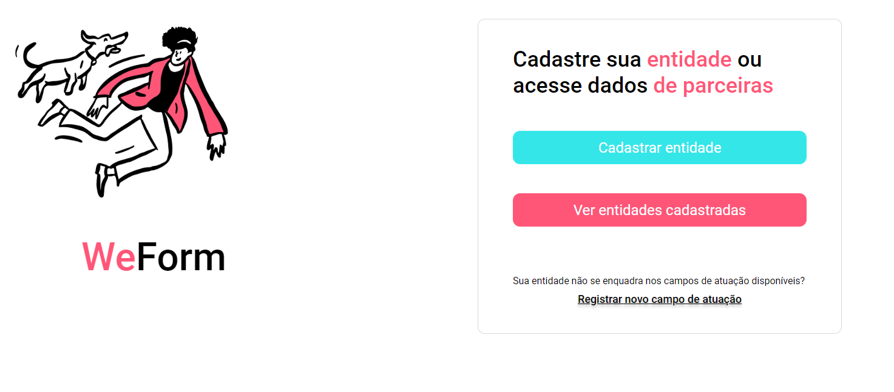
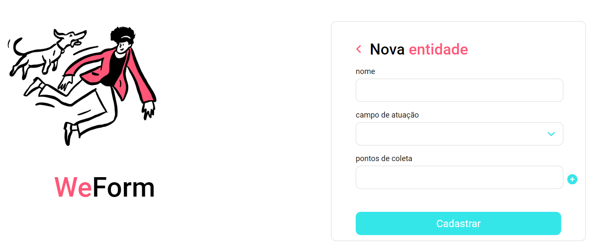

    
# Projeto CSS Santander Coders 2023 - Web Front-End

Projeto desenvolvido para aplicar conhecimentos de CSS estudados em aula. O foco do exercício foi apenas na aparência da página, sem incluir as funcionalidades. Esta página foi toda baseada no projeto do Figma disponibilizado pelo professor que pode ser acessado <a href="https://www.figma.com/file/w11Rpk9e1tqreNMtHAVrDm/We-Form?type=design&node-id=0-1&mode=design&t=gUvvb4W5jGQSzvJu-0">aqui</a>.

🔎 Visite a página <a href="https://viquiiz.github.io/css-projeto-pagina-weform-santandercoders/">aqui</a> ou, para rodar localmente, é só fazer o download desse repositório e abrir o arquivo "index.html".

#### Preview:

    
    

